# GDG SGU GEN-AI 

## Cheat Sheet for SKill Badges 

### Skill Badge 1 - The Basics of Google Cloud Compute

<details>
  <summary>Lab No. 1 : Creating a Virtual Machine  GSP001</summary>

  - **Step 1** : Start The lab 
  - **Step 2** : Open The Google Cloud Console into the incognative mode
  - **Step 3** : Login Using the username and Password given in the perticular lab
  - **Step 4** : Open the Google Cloud Console 
  - **Step 5** : Go to Lab instructions.
  - **Step 6** : Scroll down A little bit and u see the section called As shown in the image bellow

    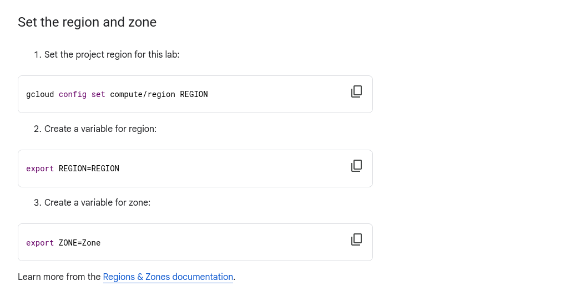 

    ### Note : The Region and Zone might be different

  - **Step 7** : Copy And paste those 3 commands one by one in the google cloud console 
  - **Step 8** : Copy the Commands given below and paste it in the google cloud console 

  ```bash
    curl -LO raw.githubusercontent.com/QUICK-GCP-LAB/2-Minutes-Labs-Solutions/main/Creating%20a%20Virtual%20Machine/gsp001.sh
    sudo chmod +x gsp001.sh
    ./gsp001.sh
  ```

  - ### Lab is completed

  - ### Note : If You Having Any Trouble reffer this Video [Creating a Virtual Machine GSP001](https://www.youtube.com/watch?v=3wUSkRhedag) 

</details>

<details>
  <summary>Lab No. 2 : Creating a Persistent Disk GSP004</summary>

  - **Step 1** : Start The lab 
  - **Step 2** : Open The Google Cloud Console into the incognative mode
  - **Step 3** : Login Using the username and Password given in the perticular lab
  - **Step 4** : Open the Google Cloud Console 
  - **Step 5** : Go to Lab instructions.
  - **Step 6** : Scroll down A little bit and u see the section called As shown in the image bellow

    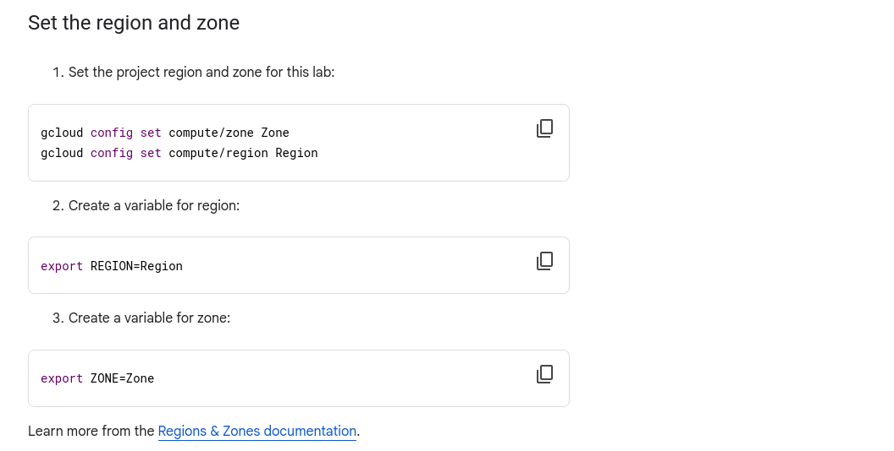 

    ### Note : The Region and Zone might be different

  - **Step 7** : Copy And paste those 3 commands one by one in the google cloud console 
  - **Step 8** : Copy the Commands given below and paste it in the google cloud console 

  ```bash
    curl -LO raw.githubusercontent.com/QUICK-GCP-LAB/2-Minutes-Labs-Solutions/main/Creating%20a%20Persistent%20Disk/gsp004.sh
    sudo chmod +x gsp004.sh
    ./gsp004.sh
  ```

  - ### Lab is completed

  - ### Note : If You Having Any Trouble reffer this Video [Creating a Persistent Disk GSP004](https://www.youtube.com/watch?v=oUnQLeuEDs8&t=16s)

</details>

<details>
  <summary>Lab No. 3 : Hosting a Web App on Google Cloud Using Compute Engine GSP662</summary>

  - **Step 1** : Start The lab 
  - **Step 2** : Open The Google Cloud Console into the incognative mode
  - **Step 3** : Login Using the username and Password given in the perticular lab
  - **Step 4** : Open the Google Cloud Console 
  - **Step 5** : Go to Lab instructions.
  - **Step 6** : Scroll down A little bit and u see the section called As shown in the image bellow

    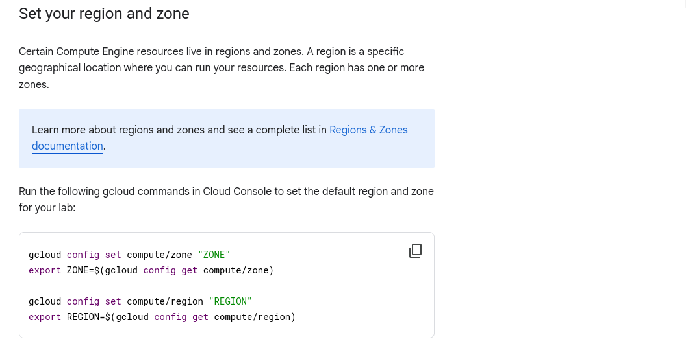 

    ### Note : The Region and Zone might be different

  - **Step 7** : Copy And paste that commands in the google cloud console 
  - **Step 8** : Copy the Commands given below and paste it in the google cloud console 

  ```bash
    curl -LO raw.githubusercontent.com/QUICK-GCP-LAB/2-Minutes-Labs-Solutions/main/Hosting%20a%20Web%20App%20on%20Google%20Cloud%20Using%20Compute%20Engine/gsp662-1.sh
    sudo chmod +x gsp662-1.sh
    ./gsp662-1.sh
  ```
  - ### Check All Score Upto Task 6
  
  ```bash
    curl -LO raw.githubusercontent.com/QUICK-GCP-LAB/2-Minutes-Labs-Solutions/main/Hosting%20a%20Web%20App%20on%20Google%20Cloud%20Using%20Compute%20Engine/gsp662-2.sh
    sudo chmod +x gsp662-2.sh
    ./gsp662-2.sh
  ```

  - ### Lab is completed

  - ### Note : If You Having Any Trouble reffer this Video [Hosting a Web App on Google Cloud Using Compute Engine GSP662](https://www.youtube.com/watch?v=um0RpF0k070)

</details>
<details>
  <summary>Lab No. 4 : The Basics of Google Cloud Compute: Challenge Lab ARC120</summary>

  - **Step 1** : Start The lab 
  - **Step 2** : Open The Google Cloud Console into the incognative mode
  - **Step 3** : Login Using the username and Password given in the perticular lab
  - **Steo 4** : Go to Create a bucket from [Click Here](https://console.cloud.google.com/storage/create-bucket)
  - **Steo 5** : Go to Lab instructions.
  - **Steo 6** : Scroll down A little bit and u see the section called As shown in the image bellow
      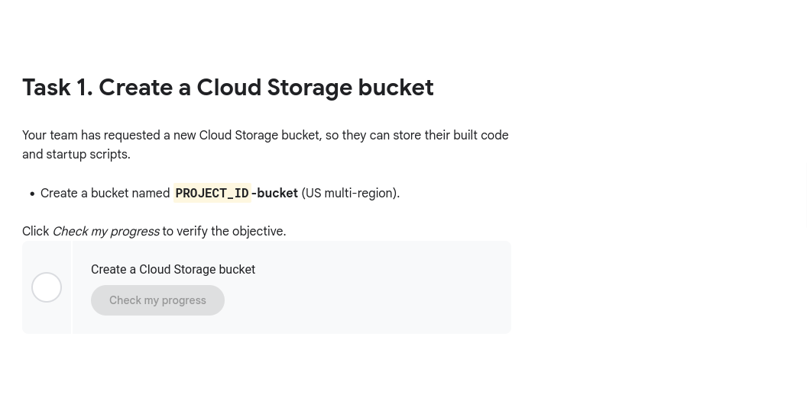 
      ### Note : The `PROJECT_ID` migth be different and don't forget to copy `-bucket` also `PROJECT_ID-bucket`.
  - **Step 7** : Create the Bucket.
  - **Step 8** : Copy the Commands given below and paste it in the google cloud console 
  - ### Replace the `<YOUR_ZONE>` before pasting.
  ```bash
    export ZONE=<YOUR_ZONE>
  ```
  - **Steo 9** : For `<YOUR_ZONE>` Go to Lab instructions again.
  - **Steo 10** : Scroll down A little bit and u see the section called As shown in the image bellow
      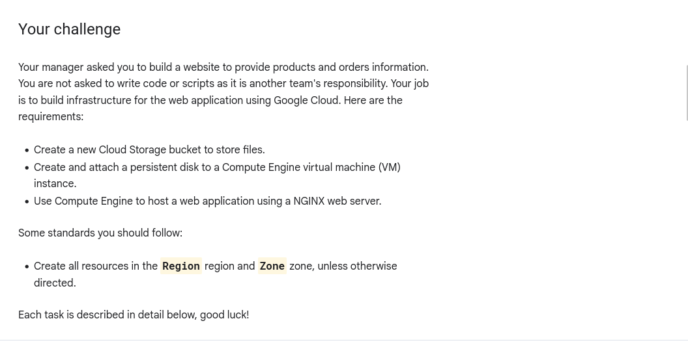 
      ### Note : The `Zone` migth be different.

  - **Step 11** : Copy the Commands given below and paste it in the google cloud console 

  ```bash
    curl -LO raw.githubusercontent.com/QUICK-GCP-LAB/2-Minutes-Labs-Solutions/main/The%20Basics%20of%20Google%20Cloud%20Compute%20Challenge%20Lab/arc120.sh
    sudo chmod +x arc120.sh
    ./arc120.sh
  ```

  - ### Lab is completed

  - ### Note : If You Having Any Trouble reffer this Video [The Basics of Google Cloud Compute: Challenge Lab ARC120](https://www.youtube.com/watch?v=XAwPdcW5iZY) 

</details>

### Skill Badge 2 - Get Started with Cloud Storage 

<details>
  <summary>Lab No. 1 : APIs Explorer: Cloud Storage GSP421</summary>

  - **Step 1** : Start The lab 
  - We Need to Complete this Lab without the commands so follow this video [APIs Explorer: Cloud Storage GSP421](https://www.youtube.com/watch?v=M2kq4hF1PLo) 

</details>

<details>
  <summary>Lab No. 2 : Cloud Storage: Qwik Start - CLI/SDK GSP074</summary>

  - **Step 1** : Start The lab 
  - **Step 2** : Open The Google Cloud Console into the incognative mode
  - **Step 3** : Login Using the username and Password given in the perticular lab
  - **Step 4** : Open the Google Cloud Console 
  - **Step 5** : Go to Lab instructions.
  - **Step 6** : Scroll down A little bit and u see the section called As shown in the image bellow

    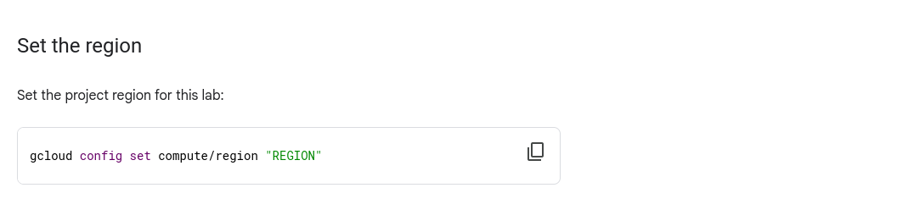 

    ### Note : The Region might be different

  - **Step 7** : Copy And paste that commands in the google cloud console 
  - **Step 8** : Copy the Commands given below and paste it in the google cloud console 

  ```bash
    curl -LO raw.githubusercontent.com/quiccklabs/Labs_solutions/master/Cloud%20Storage%20Qwik%20Start%20%20CLISDK/quicklabgsp074.sh
    sudo chmod +x quicklabgsp074.sh
    ./quicklabgsp074.sh
  ```

  - ### Lab is completed

  - ### Note : If You Having Any Trouble reffer this Video [Cloud Storage: Qwik Start - CLI/SDK GSP074](https://www.youtube.com/watch?v=MMWekrX-46M)

</details>

<details>
  <summary>Lab No. 3 : Google Cloud Storage - Bucket Lock GSP297</summary>

  - **Step 1** : Start The lab 
  - **Step 2** : Open The Google Cloud Console into the incognative mode
  - **Step 3** : Login Using the username and Password given in the perticular lab
  - **Step 4** : Open the Google Cloud Console 
  - **Step 5** : Go to Lab instructions.
  - **Step 6** : Scroll down A little bit and u see the section called As shown in the image bellow

    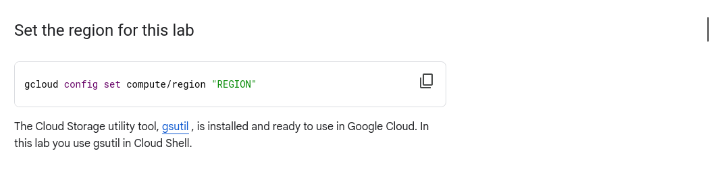 

    ### Note : The Region might be different

  - **Step 7** : Copy And paste that commands in the google cloud console 
  - **Step 8** : Copy the Commands given below and paste it in the google cloud console 

  ```bash
    curl -LO raw.githubusercontent.com/QUICK-GCP-LAB/2-Minutes-Labs-Solutions/main/Google%20Cloud%20Storage%20-%20Bucket%20Lock/gsp297.sh
    sudo chmod +x gsp297.sh
    ./gsp297.sh
  ```

  - ### Lab is completed

  - ### Note : If You Having Any Trouble reffer this Video [Google Cloud Storage - Bucket Lock GSP297](https://www.youtube.com/watch?v=ROLigBsAx3A)

</details>
<details>
  <summary>Lab No. 4 : Get Started with Cloud Storage: Challenge Lab ARC111</summary>

  - **Step 1** : Start The lab 
  - Follow this video [APIs Explorer: Cloud Storage GSP421](https://www.youtube.com/watch?v=M2kq4hF1PLo) 

</details>

### SKill Badge 3 - Get Started with API Gateway 

<details>
  <summary>Lab No. 1 : API Gateway: Qwik Start GSP782</summary>

  - **Step 1** : Start The lab 
  - **Step 2** : Open The Google Cloud Console into the incognative mode
  - **Step 3** : Login Using the username and Password given in the perticular lab
  - **Step 4** : Go to lab Insturctions.
  - **Steo 5** : Copy the Commands given below and paste it in the google cloud console 
  - **Steo 6** : Scroll down A little bit and u see the section called As shown in the image bellow
      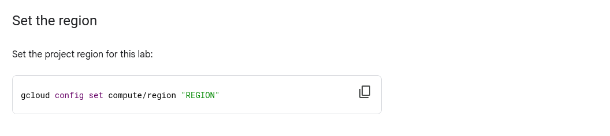 
      ### Note : The `Region` migth be different.

  - **Step 7** : Copy the Commands given below and paste it in the google cloud console 

  ```bash
    curl -LO raw.githubusercontent.com/QUICK-GCP-LAB/2-Minutes-Labs-Solutions/main/API%20Gateway%20Qwik%20Start/gsp872.sh
    sudo chmod +x gsp872.sh
    ./gsp872.sh
  ```

  - ### Lab is completed

  - ### Note : If You Having Any Trouble reffer this Video [API Gateway: Qwik Start GSP782](https://www.youtube.com/watch?v=5Ae2ftnjJfM) 

</details>
<details>
  <summary>Lab No. 2 : Pub/Sub: Qwik Start - Console GSP096</summary>

  - **Step 1** : Start The lab 
  - **Step 2** : Open The Google Cloud Console into the incognative mode
  - **Step 3** : Login Using the username and Password given in the perticular lab
  - **Step 4** : Open the Google Cloud Console 
  - **Step 8** : Copy the Commands given below and paste it in the google cloud console 

  ```bash
    gcloud pubsub topics create myTopic
    gcloud  pubsub subscriptions create --topic myTopic MySub
  ```

  - ### Lab is completed

  - ### Note : If You Having Any Trouble reffer this Video [Pub/Sub: Qwik Start - Console GSP096](https://www.youtube.com/watch?v=cAoJDu1BcJA)

</details>
<details>
  <summary>Lab No. 3 : Cloud Run Functions: Qwik Start - Console GSP081</summary>

  - **Step 1** : Start The lab 
  - **Step 2** : Open The Google Cloud Console into the incognative mode
  - **Step 3** : Login Using the username and Password given in the perticular lab
  - **Step 4** : Copy the Commands given below and paste it in the google cloud console 
  - ### Replace the `<YOUR_REGION>` before pasting.
  ```bash
    export REGION=<YOUR_REGION>
  ```
  - **Steo 5** : For `<YOUR_REGION>` Go to Lab instructions again.
  - **Steo 6** : Scroll down A little bit and u see the section called As shown in the image bellow
      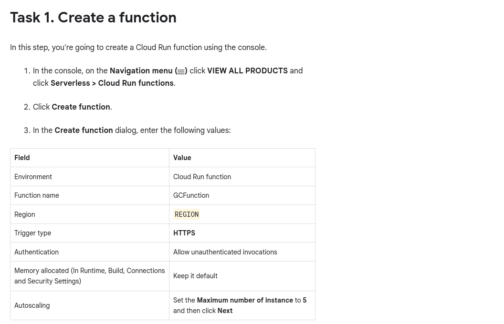 
      ### Note : The `Region` migth be different.

  - **Step 7** : Copy the Commands given below and paste it in the google cloud console 

  ```bash
    curl -LO raw.githubusercontent.com/QUICK-GCP-LAB/2-Minutes-Labs-Solutions/main/Cloud%20Functions%20Qwik%20Start%20-%20Console/gsp081.sh
    sudo chmod +x gsp081.sh
    ./gsp081.sh
  ```

  - ### Lab is completed

  - ### Note : If You Having Any Trouble reffer this Video [Cloud Run Functions: Qwik Start - Console GSP081](https://www.youtube.com/watch?v=-8vxVRA2ruk) 

</details>
<details>
  <summary>Lab No. 4 : Getting Started with API Gateway: Challenge Lab ARC109</summary>

  - **Step 1** : Start The lab 
  - **Step 2** : Open The Google Cloud Console into the incognative mode
  - **Step 3** : Login Using the username and Password given in the perticular lab
  - **Step 4** : Copy the Commands given below and paste it in the google cloud console 
  - ### Replace the `<YOUR_REGION>` before pasting.
  ```bash
    export REGION=<YOUR_REGION>
  ```
  - **Steo 5** : For `<YOUR_REGION>` Go to Lab instructions again.
  - **Steo 6** : Scroll down A little bit and u see the section called As shown in the image bellow
      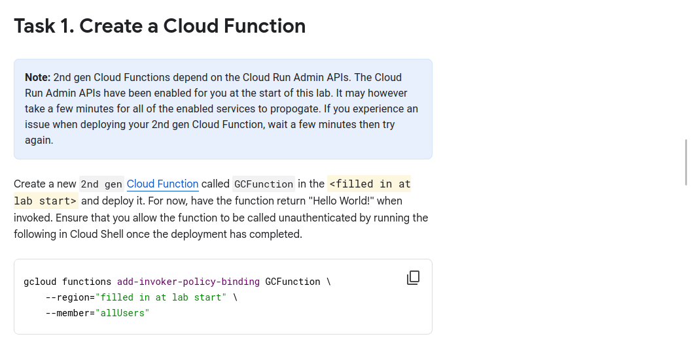 
      ### Note : The `Region` migth be different.

  - **Step 7** : Copy the Commands given below and paste it in the google cloud console 

  ```bash
    curl -LO raw.githubusercontent.com/QUICK-GCP-LAB/2-Minutes-Labs-Solutions/main/Getting%20Started%20with%20API%20Gateway%20Challenge%20Lab/arc109.sh
    sudo chmod +x arc109.sh
    ./arc109.sh
  ```

  - ### Lab is completed

  - ### Note : If You Having Any Trouble reffer this Video [Getting Started with API Gateway: Challenge Lab ARC109](https://www.youtube.com/watch?v=iWRh0xCKwRQ) 

</details>

### Skill Badge 4 - Get Started with Looker 

<details>
  <summary>Lab No. 1 : Looker Studio: Qwik Start GSP136</summary>

  - **Step 1** : Start The lab 
  - We Need to Complete this Lab without the commands so follow this video [Looker Studio: Qwik Start GSP136](https://www.youtube.com/watch?v=NYra6SWFrwQ) 

</details>
<details>
  <summary>Lab No. 2 : Looker Data Explorer - Qwik Start GSP718</summary>

  - **Step 1** : Start The lab 
  - We Need to Complete this Lab without the commands so follow this video [Looker Data Explorer - Qwik Start GSP718](https://www.youtube.com/watch?v=uZaNj0Mpz4s) 

</details>
<details>
  <summary>Lab No. 3 : Looker Developer: Qwik Start GSP891</summary>

  - **Step 1** : Start The lab 
  - We Need to Complete this Lab without the commands so follow this video [Looker Developer: Qwik Start GSP891](https://www.youtube.com/watch?v=wNgUf8-XfLM) 

</details>
<details>
  <summary>Lab No. 4 : Get Started with Looker: Challenge Lab ARC107</summary>

  - **Step 1** : Start The lab 
  - We Need to Complete this Lab without the commands so follow this video [Get Started with Looker: Challenge Lab ARC107](https://www.youtube.com/watch?v=qdFwc3OY3nA) 

</details>

### Skill Badge 5 - Get Started with Dataplex 

<details>
  <summary>Lab No. 1 : Dataplex: Qwik Start - Console GSP1143</summary>

  - **Step 1** : Start The lab 
  - **Step 2** : Open The Google Cloud Console into the incognative mode
  - **Step 3** : Login Using the username and Password given in the perticular lab
  - **Step 4** : Copy the Commands given below and paste it in the google cloud console 
  - ### Replace the `<YOUR_REGION>` before pasting.
  ```bash
    export REGION=<YOUR_REGION>
  ```
  - **Steo 5** : For `<YOUR_REGION>` Go to Lab instructions again.
  - **Steo 6** : Scroll down A little bit and u see the section called As shown in the image bellow
      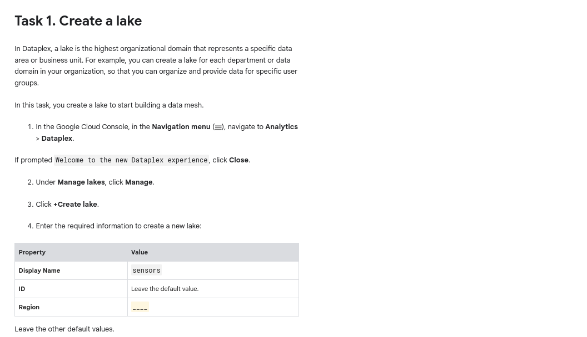 
      ### Note : The `Region` migth be different.

  - **Step 7** : Copy the Commands given below and paste it in the google cloud console 

  ```bash
    curl -LO raw.githubusercontent.com/QUICK-GCP-LAB/2-Minutes-Labs-Solutions/main/Dataplex%20Qwik%20Start%20-%20Console/gsp1143.sh
    sudo chmod +x gsp1143.sh
    ./gsp1143.sh
  ```

  - ### Lab is completed

  - ### Note : If You Having Any Trouble reffer this Video [Dataplex: Qwik Start - Console GSP1143](https://www.youtube.com/watch?v=yDQfs8fNBgM) 

</details>
<details>
  <summary>Lab No. 2 : Dataplex: Qwik Start - Command Line GSP1144</summary>

  - **Step 1** : Start The lab 
  - **Step 2** : Open The Google Cloud Console into the incognative mode
  - **Step 3** : Login Using the username and Password given in the perticular lab
  - **Step 4** : Copy the Commands given below and paste it in the google cloud console 
  - ### Replace the `<YOUR_REGION>` before pasting.
  ```bash
    export REGION=<YOUR_REGION>
  ```
  - **Steo 5** : For `<YOUR_REGION>` Go to Lab instructions again.
  - **Steo 6** : Scroll down A little bit and u see the section called As shown in the image bellow
      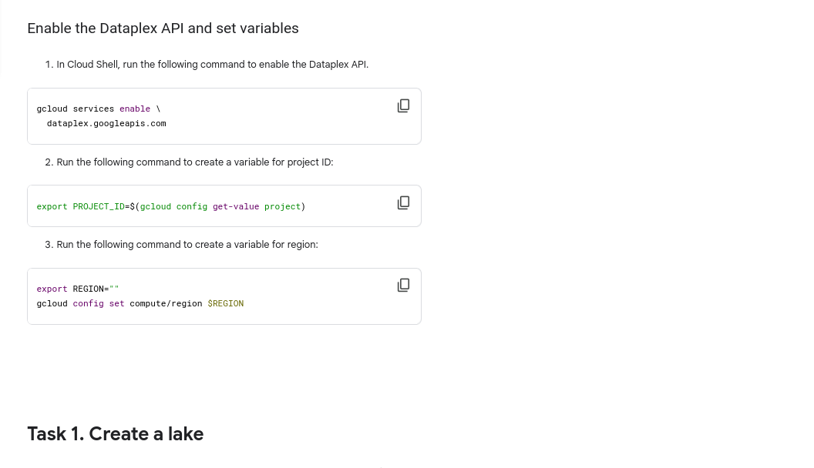 
      ### Note : The `Region` migth be different.

  - **Step 7** : Copy the Commands given below and paste it in the google cloud console 

  ```bash
    curl -LO raw.githubusercontent.com/QUICK-GCP-LAB/2-Minutes-Labs-Solutions/main/Dataplex%20Qwik%20Start%20-%20Command%20Line/gsp1144.sh
    sudo chmod +x gsp1144.sh
    ./gsp1144.sh
  ```

  - ### Lab is completed

  - ### Note : If You Having Any Trouble reffer this Video [Dataplex: Qwik Start - Command Line GSP1144](https://www.youtube.com/watch?v=GVKNYbTUDIU) 

</details>
<details>
  <summary>Lab No. 3 : Tagging Dataplex Assets GSP1145</summary>

  - **Step 1** : Start The lab 
  - **Step 2** : Open The Google Cloud Console into the incognative mode
  - **Step 3** : Login Using the username and Password given in the perticular lab
  - **Step 4** : Copy the Commands given below and paste it in the google cloud console 
  - ### Replace the `<YOUR_REGION>` before pasting.
  ```bash
    export REGION=<YOUR_REGION>
  ```
  - **Steo 5** : For `<YOUR_REGION>` Go to Lab instructions again.
  - **Steo 6** : Scroll down A little bit and u see the section called As shown in the image bellow
      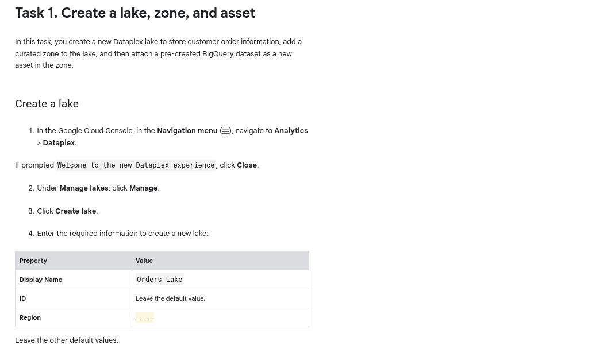 
      ### Note : The `Region` migth be different.

  - **Step 7** : Copy the Commands given below and paste it in the google cloud console 

  ```bash
    curl -LO raw.githubusercontent.com/QUICK-GCP-LAB/2-Minutes-Labs-Solutions/main/Tagging%20Dataplex%20Assets/gsp1145.sh
    sudo chmod +x gsp1145.sh
    ./gsp1145.sh
  ```

  - ### Lab is completed

  - ### Note : If You Having Any Trouble reffer this Video [Tagging Dataplex Assets GSP1145](https://www.youtube.com/watch?v=s-3nNkkocdo) 

</details>
<details>
  <summary>Lab No. 4 :  Get Started with Dataplex: Challenge Lab ARC117</summary>

  - **Step 1** : Start The lab 
  - **Step 2** : Open The Google Cloud Console into the incognative mode
  - **Step 3** : Login Using the username and Password given in the perticular lab
  - **Step 4** : Copy the Commands given below and paste it in the google cloud console 
  - ### Replace the `<YOUR_REGION>` before pasting.
  ```bash
    export REGION=<YOUR_REGION>
  ```
  - **Steo 5** : For `<YOUR_REGION>` Go to Lab instructions again.
  - **Steo 6** : Scroll down A little bit and u see the section called As shown in the image bellow
       
      ### Note : The `Region` migth be different.

  - **Step 7** : Copy the Commands given below and paste it in the google cloud console 

  ```bash
    curl -LO raw.githubusercontent.com/QUICK-GCP-LAB/2-Minutes-Labs-Solutions/main/Get%20Started%20with%20Dataplex%20Challenge%20Lab/arc117.sh
    sudo chmod +x arc117.sh
    ./arc117.sh
  ```

  - ### Lab is completed

  - ### Note : If You Having Any Trouble reffer this Video [Get Started with Dataplex: Challenge Lab ARC117](https://www.youtube.com/watch?v=NzRcltfHzu0) 

</details>

### Skill Badge 6 - Get Started with Google Workspace Tools 

<details>
  <summary>Lab No. 1 : Level Up Your Google Workspace knowledge</summary>

  - **Step 1** : Only See The Youtube Video Shown in the 

</details>
<details>
  <summary>Lab No. 2 : Gmail: Getting Started GSP465</summary>

  - **Step 1** : Start The lab 
  - We Need to Complete this Lab without the commands so follow this video [Gmail: Getting Started GSP465](https://www.youtube.com/watch?v=saL_ibySVx4) 

</details>
<details>
  <summary>Lab No. 3 : Google Calendar: Getting Started GSP466</summary>

  - **Step 1** : Start The lab 
  - We Need to Complete this Lab without the commands so follow this video [Google Calendar: Getting Started GSP466](https://www.youtube.com/watch?v=SbkqZsuJXfE) 

</details> 
<details>
  <summary>Lab No. 4 : Google Meet: Getting Started GSP467</summary>

  - **Step 1** : Start The lab 
  - We Need to Complete this Lab without the commands so follow this video [Google Meet: Getting Started GSP467](https://www.youtube.com/watch?v=NT4f67Qxkb4) 

</details>
<details>
  <summary>Lab No. 5 : Google Drive: Getting Started GSP468</summary>

  - **Step 1** : Start The lab 
  - We Need to Complete this Lab without the commands so follow this video [Google Drive: Getting Started GSP468](https://www.youtube.com/watch?v=rDmB4_RrOXs) 

</details>
<details>
  <summary>Lab No. 6 : Google Sheets: Getting Started GSP469</summary>

  - **Step 1** : Start The lab 
  - We Need to Complete this Lab without the commands so follow this video [Google Sheets: Getting Started GSP469](https://www.youtube.com/watch?v=lEvXXHKHgiw) 

</details>
<details>
  <summary>Lab No. 7 : Google AppSheet: Getting Started GSP883</summary>

  - **Step 1** : Start The lab 
  - We Need to Complete this Lab without the commands so follow this video [Google AppSheet: Getting Started GSP883](https://www.youtube.com/watch?v=GHrGaNce6WE&t=2s) 

</details>
<details>
  <summary>Lab No. 8 : Get Started with Google Workspace Tools: Challenge Lab GSP376</summary>

  - **Step 1** : Start The lab 
  - We Need to Complete this Lab without the commands so follow this video [Google Sheets: Getting Started GSP469](https://www.youtube.com/watch?v=MXNF4k07aBg) 

</details>

### Skill Badge 7 - Cloud Functions: 3 Ways

<details>
  <summary>Lab No. 1 : Cloud Run Functions: Qwik Start - Console GSP081</summary>

  - **Step 1** : Start The lab 
  - **Step 2** : Open The Google Cloud Console into the incognative mode
  - **Step 3** : Login Using the username and Password given in the perticular lab
  - **Step 4** : Copy the Commands given below and paste it in the google cloud console 
  - ### Replace the `<YOUR_REGION>` before pasting.
  ```bash
    export REGION=<YOUR_REGION>
  ```
  - **Steo 5** : For `<YOUR_REGION>` Go to Lab instructions again.
  - **Steo 6** : Scroll down A little bit and u see the section called As shown in the image bellow
      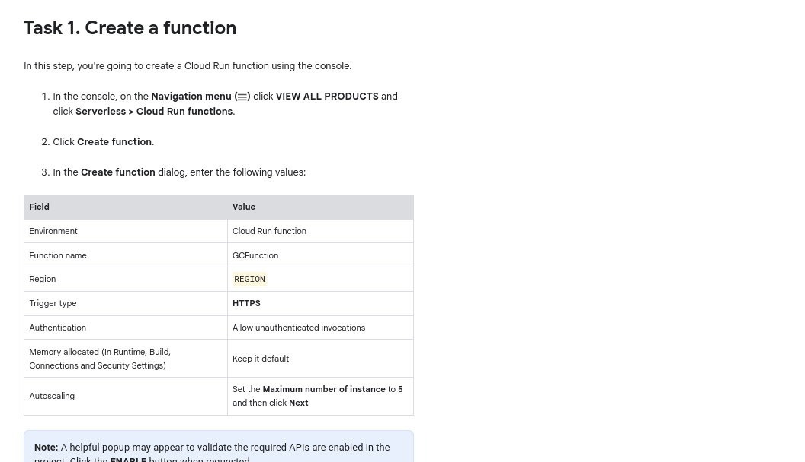 
      ### Note : The `Region` migth be different.

  - **Step 7** : Copy the Commands given below and paste it in the google cloud console 

  ```bash
    curl -LO raw.githubusercontent.com/quiccklabs/Labs_solutions/master/Cloud%20Functions%20Qwik%20Start%20%20Console/quicklabsgsp081.sh
    sudo chmod +x quicklabsgsp081.sh
    ./quicklabsgsp081.sh    
  ```

  - ### Lab is completed

  - ### Note : If You Having Any Trouble reffer this Video [Cloud Run Functions: Qwik Start - Console GSP081](https://www.youtube.com/watch?v=URAbi1yqwNE) 

</details>
<details>
  <summary>Lab No. 2 : Cloud Run Functions: Qwik Start - Command Line GSP080</summary>

  - **Step 1** : Start The lab 
  - **Step 2** : Open The Google Cloud Console into the incognative mode
  - **Step 3** : Login Using the username and Password given in the perticular lab
  - **Step 4** : Copy the Commands given below and paste it in the google cloud console 
  - ### Replace the `<YOUR_REGION>` before pasting.
  ```bash
    export REGION=<YOUR_REGION>
  ```
  - **Steo 5** : For `<YOUR_REGION>` Go to Lab instructions again.
  - **Steo 6** : Scroll down A little bit and u see the section called As shown in the image bellow
      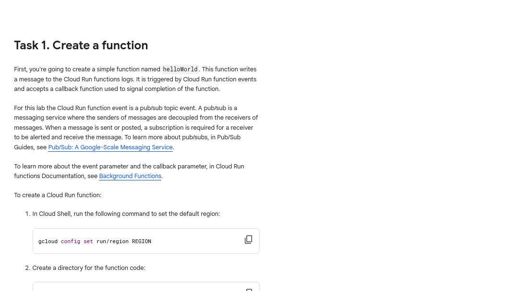 
      ### Note : The `Region` migth be different.

  - **Step 7** : Copy the Commands given below and paste it in the google cloud console 

  ```bash
    curl -LO raw.githubusercontent.com/quiccklabs/Labs_solutions/master/Cloud%20Functions%20Qwik%20Start%20Command%20Line/quicklabgsp080.sh
    sudo chmod +x quicklabgsp080.sh
    ./quicklabgsp080.sh  
  ```

  - ### Lab is completed

  - ### Note : If You Having Any Trouble reffer this Video [Cloud Run Functions: Qwik Start - Console GSP081](https://www.youtube.com/watch?v=URAbi1yqwNE) 

</details>
<details>
  <summary>Lab No. 3 : Cloud Functions 2nd Gen: Qwik Start GSP1089</summary>

  - **Step 1** : Start The lab 
  - **Step 2** : Open The Google Cloud Console into the incognative mode
  - **Step 3** : Login Using the username and Password given in the perticular lab
  - **Step 4** : Copy the Commands given below and paste it in the google cloud console 

  ```bash
    curl -LO raw.githubusercontent.com/QUICK-GCP-LAB/2-Minutes-Labs-Solutions/main/Cloud%20Functions%202nd%20Gen%20Qwik%20Start/gsp1089-1.sh
    sudo chmod +x gsp1089-1.sh
    ./gsp1089-1.sh
  ```
  - ### Check All Score Upto Task 6
  
  - **Step 5** : Copy the Commands given below and paste it in the google cloud console 

  ```bash
    curl -LO raw.githubusercontent.com/QUICK-GCP-LAB/2-Minutes-Labs-Solutions/main/Cloud%20Functions%202nd%20Gen%20Qwik%20Start/gsp1089-2.sh    
    sudo chmod +x gsp1089-2.sh
    ./gsp1089-2.sh
  ```

  - ### Lab is completed

  - ### Note : If You Having Any Trouble reffer this Video [Cloud Functions 2nd Gen: Qwik Start GSP1089](https://www.youtube.com/watch?v=mTFfyHjp5rw) 

</details>
<details>
  <summary>Lab No. 2 : Cloud Functions: 3 Ways: Challenge Lab ARC104</summary>

  - **Step 1** : Start The lab 
  - **Step 2** : Open The Google Cloud Console into the incognative mode
  - **Step 3** : Login Using the username and Password given in the perticular lab
  - **Step 4** : Copy the Commands given below and paste it in the google cloud console 
  - ### Replace the `<YOUR_REGION>` before pasting.
  ```bash
    export HTTP_FUNCTION=<YOUR_HTTP_FUNCTION>
    export FUNCTION_NAME=<YOUR_FUNCTION_NAME>
    export REGION=<YOUR_REGION>
  ```
  - **Steo 5** : For `<YOUR_HTTP_FUNCTION>,<YOUR_FUNCTION_NAME>,<YOUR_REGION>` Go to Lab instructions again.
  - **Steo 6** : Scroll down A little bit and u see the section called As shown in the image bellow
      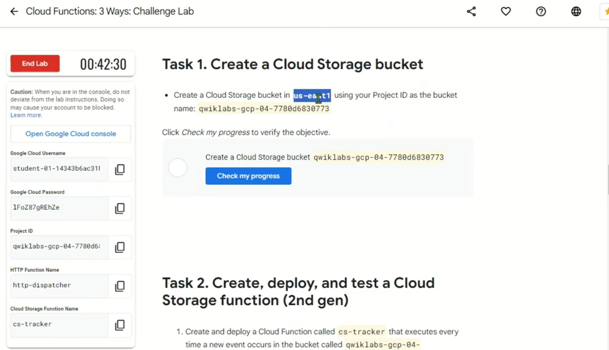 
      ### Note : The `Http Function, function, Region` migth be different.

  - **Step 7** : Copy the Commands given below and paste it in the google cloud console 

  ```bash
    curl -LO raw.githubusercontent.com/QUICK-GCP-LAB/2-Minutes-Labs-Solutions/main/Cloud%20Functions%203%20Ways%20Challenge%20Lab/arc104.sh
    sudo chmod +x arc104.sh
    ./arc104.sh
  ```

  - ### Lab is completed

  - ### Note : If You Having Any Trouble reffer this Video [Cloud Functions: 3 Ways: Challenge Lab ARC104](https://www.youtube.com/watch?v=fPVslkWDTGg) 

</details>

### Skill Badge 8 - App Engine: 3 Ways 

<details>
  <summary>Lab No. 1 : App Engine: Qwik Start - Python GSP067</summary>

  - **Step 1** : Start The lab 
  - **Step 2** : Open The Google Cloud Console into the incognative mode
  - **Step 3** : Login Using the username and Password given in the perticular lab
  - **Step 4** : Copy the Commands given below and paste it in the google cloud console 
  - ### Replace the `<YOUR_REGION>` before pasting.
  ```bash
    export REGION=<YOUR_REGION>
  ```
  - **Steo 5** : For `<YOUR_REGION>` Go to Lab instructions again.
  - **Steo 6** : Scroll down A little bit and u see the section called As shown in the image bellow
      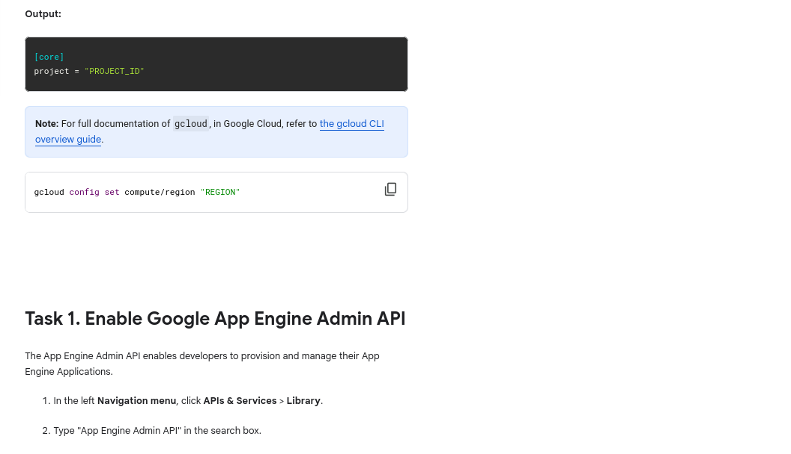 
      ### Note : The `Region` migth be different.

  - **Step 7** : Copy the Commands given below and paste it in the google cloud console 

  ```bash
    curl -LO raw.githubusercontent.com/QUICK-GCP-LAB/2-Minutes-Labs-Solutions/main/App%20Engine%20Qwik%20Start%20-%20Python/gsp067.sh
    sudo chmod +x gsp067.sh
    ./gsp067.sh
  ```

  - ### Lab is completed

  - ### Note : If You Having Any Trouble reffer this Video [App Engine: Qwik Start - Python GSP067](https://www.youtube.com/watch?v=Lq7ZW37tUIM) 

</details>
<details>
  <summary>Lab No. 2 : App Engine: Qwik Start - Go GSP070</summary>

  - **Step 1** : Start The lab 
  - **Step 2** : Open The Google Cloud Console into the incognative mode
  - **Step 3** : Login Using the username and Password given in the perticular lab
  - **Step 4** : Copy the Commands given below and paste it in the google cloud console 
  - ### Replace the `<YOUR_REGION>` before pasting.
  ```bash
    export REGION=<YOUR_REGION>
  ```
  - **Steo 5** : For `<YOUR_REGION>` Go to Lab instructions again.
  - **Steo 6** : Scroll down A little bit and u see the section called As shown in the image bellow
       
      ### Note : The `Region` migth be different.

  - **Step 7** : Copy the Commands given below and paste it in the google cloud console 

  ```bash
    curl -LO raw.githubusercontent.com/QUICK-GCP-LAB/2-Minutes-Labs-Solutions/main/App%20Engine%20Qwik%20Start%20-%20Go/gsp070.sh
    sudo chmod +x gsp070.sh
    ./gsp070.sh
  ```

  - ### Lab is completed

  - ### Note : If You Having Any Trouble reffer this Video [App Engine: Qwik Start - Go GSP070](https://www.youtube.com/watch?v=3cVxYis4Hj8) 

</details>
<details>
  <summary>Lab No. 3 : App Engine: Qwik Start - PHP GSP069</summary>

  - **Step 1** : Start The lab 
  - **Step 2** : Open The Google Cloud Console into the incognative mode
  - **Step 3** : Login Using the username and Password given in the perticular lab
  - **Step 4** : Copy the Commands given below and paste it in the google cloud console 
  - ### Replace the `<YOUR_REGION>` before pasting.
  ```bash
    export REGION=<YOUR_REGION>
  ```
  - **Steo 5** : For `<YOUR_REGION>` Go to Lab instructions again.
  - **Steo 6** : Scroll down A little bit and u see the section called As shown in the image bellow
       
      ### Note : The `Region` migth be different.

  - **Step 7** : Copy the Commands given below and paste it in the google cloud console 

  ```bash
    curl -LO raw.githubusercontent.com/quiccklabs/Labs_solutions/master/App%20Engine%20Qwik%20Start%20PHP/quicklabgsp069.sh
    sudo chmod +x quicklabgsp069.sh
    ./quicklabgsp069.sh
  ```

  - ### Lab is completed

  - ### Note : If You Having Any Trouble reffer this Video [App Engine: Qwik Start - PHP GSP069](https://www.youtube.com/watch?v=sxlXdG7sLy4) 

</details>
<details>
  <summary>Lab No. 4 : App Engine: 3 Ways: Challenge Lab ARC112</summary>

  - **Step 1** : Start The lab 
  - **Step 2** : Open The Google Cloud Console into the incognative mode
  - **Step 3** : Login Using the username and Password given in the perticular lab
  - **Step 4** : Copy the Commands given below and paste it in the google cloud console 
  - ### Replace the `<YOUR_MESSAGE>` before pasting.
  ```bash
    export MESSAGE=<YOUR_MESSAGE>
  ```
  - **Steo 5** : For `<YOUR_MESSAGE>` Go to Lab instructions again.
  - **Steo 6** : Scroll down A little bit and u see the section called As shown in the image bellow
       
      ### Note : The `MESSAGE` migth be different.

  - **Step 7** : Copy the Commands given below and paste it in the google cloud console 

  ```bash
    curl -LO raw.githubusercontent.com/QUICK-GCP-LAB/2-Minutes-Labs-Solutions/main/App%20Engine%203%20Ways%20Challenge%20Lab/arc112.sh
    sudo chmod +x arc112.sh 
    ./arc112.sh
  ```

  - ### Lab is completed

  - ### Note : If You Having Any Trouble reffer this Video [App Engine: 3 Ways: Challenge Lab ARC112](https://www.youtube.com/watch?v=sX1-LFEsizo) 

</details>

### Skill Badge 9 - Cloud Speech API: 3 Ways 

<details>
  <summary>Lab No. 1 : It Speaks! Create Synthetic Speech Using Text-to-Speech GSP222</summary>

  - **Step 1** : Start The lab 
  - **Step 2** : Open The Google Cloud Console into the incognative mode
  - **Step 3** : Login Using the username and Password given in the perticular lab
  - **Step 7** : Copy the Commands given below and paste it in the google cloud console 

  ```bash
    curl -LO raw.githubusercontent.com/quiccklabs/Labs_solutions/master/Create%20Synthetic%20Speech%20Using%20quicklab/quicklabgsp222.sh
    sudo chmod +x quicklabgsp222.sh
    ./quicklabgsp222.sh
  ```

  - ### Lab is completed

  - ### Note : If You Having Any Trouble reffer this Video [It Speaks! Create Synthetic Speech Using Text-to-Speech GSP222](https://www.youtube.com/watch?v=ZrC1bktIC9I) 

</details>
<details>
  <summary>Lab No. 2 : Translate Text with the Cloud Translation API GSP049</summary>

  - **Step 1** : Start The lab 
  - We Need to Complete this Lab without the commands so follow this video [Translate Text with the Cloud Translation API GSP049](https://www.youtube.com/watch?v=QIyAKsou5CM) 

</details>
<details>
  <summary>Lab No. 3 : Speech to Text Transcription with the Cloud Speech API GSP048</summary>

  - **Step 1** : Start The lab 
  - **Step 2** : Open The Google Cloud Console into the incognative mode
  - **Step 3** : Login Using the username and Password given in the perticular lab
  - **Step 4** : Copy the Commands given below and paste it in the google cloud console 

  ```bash
    curl -LO raw.githubusercontent.com/QUICK-GCP-LAB/2-Minutes-Labs-Solutions/main/Speech%20to%20Text%20Transcription%20with%20the%20Cloud%20Speech%20API/gsp048-1.sh   
    sudo chmod +x gsp048-1.sh
    ./gsp048-1.sh
  ```
  - ###  Now Check The Score Upto Task 3 then Process Next.
  
  - **Step 5** : Copy the Commands given below and paste it in the google cloud console 

  ```bash
    curl -LO raw.githubusercontent.com/QUICK-GCP-LAB/2-Minutes-Labs-Solutions/main/Speech%20to%20Text%20Transcription%20with%20the%20Cloud%20Speech%20API/gsp048-2.sh
    sudo chmod +x gsp048-2.sh
    ./gsp048-2.sh
  ```

  - ### Lab is completed

  - ### Note : If You Having Any Trouble reffer this Video [Speech to Text Transcription with the Cloud Speech API GSP048](https://www.youtube.com/watch?v=Hs4Gpdcb5WI) 

</details>
<details>
  <summary>Lab No. 2 : Cloud Speech API 3 Ways: Challenge Lab ARC132</summary>

  - **Step 1** : Start The lab 
  - Follow this video [Cloud Speech API 3 Ways: Challenge Lab ARC132](https://www.youtube.com/watch?v=eQIWNzs-0NA) 

</details>